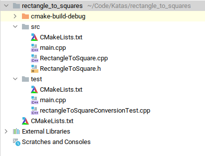
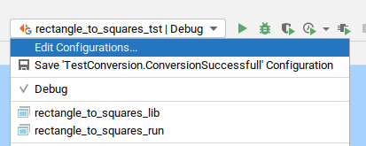

# cppbstrap
Basic C++ project bootstrapper

It automates the steps required to set up a new C++ project in with CMake support which uses a central installation of 
Google-Test. It describes how to lay out your project's file structure and prepare the CMakeLists.txt files for cmake 
to:  
1. Compile your code. 
2. Compile your tests. 
 
The script (and how-to) was written with CLion IDE in mind (hence the images and reference), but it is generalizable. 

**Motivation**

There is a great [how-to](https://raymii.org/s/tutorials/Cpp_project_setup_with_cmake_and_unit_tests.html) (not CLion 
specific) on how to prepare a C++ project, but it has one shortcoming. 

There are various Google-Test "placement" scenarios one can follow to utilize GTest. The above guide chooses to clone 
Google-Test in a directory within the project's workspace. 

I didn't want to do that. I have many small projects, and cloning the whole of GTest in each one of them is an overkill.
I wanted to use the central installation of GTest and each project to reference this installation.

In CLion's documentation web page, there is also a [guide](https://www.jetbrains.com/help/clion/unit-testing-tutorial.html#adding-framework)
on how to do this, but it is not very explanatory as to how it works and has the same shortcoming as above. Also, CLion 
compiles the code as a library which then references from the Unit-Tests. I wanted my code to produce an executable. 

**Folder Structure** 

This is the same as in raymii's guide, only I do not need the lib directory since the project will not be hosting a 
clone of GTest.

I have an src directory for my source code, and a test directory for my unit tests. Along with the project's workspace, 
this means 3 CMakeLists.txt files. 

**1. Project's workspace folder CMakeLists.txt**  

This file glues all inner directories together. It is very important to issue the "include_directories(src)" command, 
to denote where our code's declarations are. Unit-Tests will be needing this info as well. 
Notice the difference from the how-to in the end. Google-Test is not part of the project, hence it need not be included. 
~~~
cmake_minimum_required(VERSION 3.17) 

project(rectangle_to_squares) 
 
set(CMAKE_CXX_STANDARD 14) 
 
include_directories(src) 
add_subdirectory(src) 
add_subdirectory(test) 
~~~

**2. Src folder CMakeLists.txt** 

Here we have no differences with the how-to.  
~~~
set(BINARY ${CMAKE_PROJECT_NAME}) 
 
file(GLOB_RECURSE SOURCES LIST_DIRECTORIES true *.h *.cpp) 
 
set(SOURCES ${SOURCES}) 
add_executable(${BINARY}_run ${SOURCES}) 
add_library(${BINARY}_lib STATIC ${SOURCES}) 
~~~
 

What I found really neat is the duality of this set-up. In the last two lines we instruct any interpreting tool that we 
want two set-ups.
We want to be able to build the code :
1. as an executable.
2. as a statically linked library 

CLion recognizes this and automatically prepares and offers two separate build configurations, one for each case.

We discuss the importance of the static library build in the next part. 

**3. Test directory CMakeLists.txt** 
 

In this file I first tell CMake to locate where Google-test has been installed (#1). This is done by some build in 
extension of CMake named FindGTest, made for Google-Test. Next I instruct CMake to create an executable to run our 
tests(#2). Finally, to provide our Unit-Tests with the code that they test, I link against the static library produced 
by the lib configuration defined in step 2) (#3). 
~~~
find_package(GTest REQUIRED) #1 
 
set(BINARY ${CMAKE_PROJECT_NAME}_tst) 
 
file(GLOB_RECURSE TEST_SOURCES LIST_DIRECTORIES false *.h *.cpp) 
 
set(SOURCES ${TEST_SOURCES}) 
 
add_executable(${BINARY} ${TEST_SOURCES}) #2 
 
target_link_libraries(${BINARY} PUBLIC ${CMAKE_PROJECT_NAME}_lib ${GTEST_BOTH_LIBRARIES}) #3 
~~~
 

 

I found that I didn't need the enable_tests and add_test directives to compile and run my tests. I wasn't able to figure
out why not.  